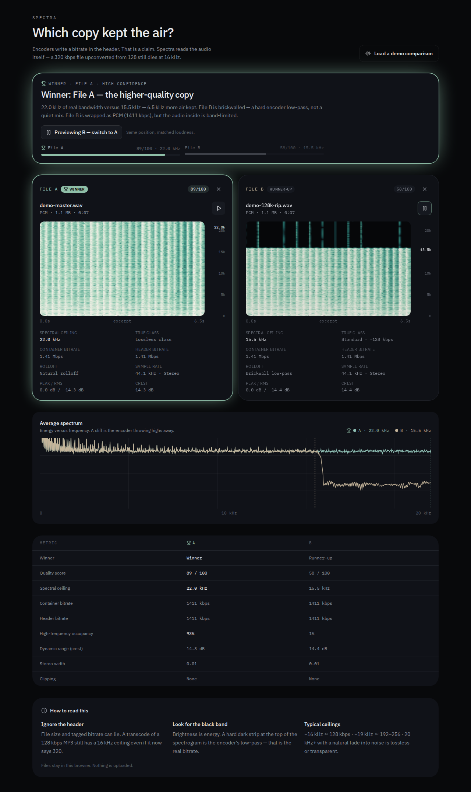

# Spectra

Which copy kept the air? Drop two files of the *same song* from different
sources (a SoundCloud MP3 vs an M4A, a WAV vs a FLAC) and Spectra tells you
which one is actually higher quality — by reading the audio, not the header.



Encoders write a bitrate in the header. That is a claim: a 320 kbps file
upconverted from 128 still dies at 16 kHz. Spectra decodes each file in your
browser, runs a spectral analysis, and finds the **spectral ceiling** — the
frequency where the encoder truly gave up — plus rolloff character, a
0–100 quality score, dynamics, and stereo info. Everything runs locally;
**no file ever leaves your browser.**

## Features

- **True-bitrate detection** — spectral ceiling, brickwall/steep/natural
  rolloff classification, and a codec-only quality score, calibrated on a
  52-item labeled corpus (MP3, AAC, Opus, transcodes, upconverts).
- **Fake-lossless flagging** — a WAV/FLAC/ALAC that measures band-limited
  gets called out, whatever the header claims.
- **Side-by-side evidence** — per-file spectrograms with cutoff markers,
  an overlaid average-spectrum plot, and a metric-by-metric table.
- **A/B compare by ear** — one click previews both copies back-to-back at
  the same position with RMS-matched loudness, plus a global volume slider.
- **Honest ties** — quiet/acoustic material with no high-frequency content
  is reported as source-limited instead of misgraded.
- **Fast on big files** — DSP runs in a Web Worker, results are cached in
  IndexedDB (re-drops resolve instantly), and 15+ minute files analyze from
  excerpts with a "Lite" badge instead of exhausting memory.

## Quickstart

Requires Node 22.

```sh
npm install
npm run dev      # http://0.0.0.0:8080
npm run build    # production bundle + DB migrate (skips without DATABASE_URL)
npm run typecheck
npm test         # repo unit suites
```

Drop two audio files (MP3, M4A/AAC, WAV, FLAC, OGG/Opus) into File A and
File B — or press **Load a demo comparison** to see a full-range master
called out against a 16 kHz brickwalled rip hiding behind identical headers.

## How it works

`src/lib/audio/analyze.ts` is the engine: Web Audio decode → mono mix-down
with sustained-clip detection → windowed STFT (4096-pt Hann, 50% overlap)
over loudness-ranked regions → occupancy + mean-spectrum cliff detection for
the cutoff → ratio-aware quality classes → composite score → verdict with
jitter-proof win margins. Header sniffing (`sniff.ts`) is deliberately
distrusted: VBR MP3s report unknown bitrate instead of the first-frame
placeholder, and MP4 average-bitrate reads the descriptor properly.

The DSP core (`runDsp`) is shared verbatim between the main-thread fallback
and `dsp.worker.ts`, so both paths produce identical numbers by construction.

## Validating with the corpus

`scripts/corpus/` holds the reproducible harness behind the numbers above
(see its README for the recipe): synth → encode at known bitrates → decode
with the browser's own decoder → score with the real detection code. Any
threshold change must re-pass the 52-item confusion matrix and all 15
reference verdicts.

## Privacy

Analysis is 100% client-side. Files are read via blob URLs and object URLs
that never leave the tab; the IndexedDB result cache stays on your device.

## License

MIT — see [LICENSE](LICENSE).
